Worked Examples
===============

This page introduces the main ways to use ``pygenstates``. The examples are
adapted from the worked notebooks in the repository's
`examples <https://github.com/gflower480/pygenstates/tree/main/examples>`_
folder. The solver can be applied to a variety of systems, but several examples
use circuit QED notation because that is one of the motivating applications.

The continuous solver represents Hamiltonians of the form

.. math::

   \left[-\sum_i k_{ii}\frac{\partial^2}{\partial x_i^2}
   -\sum_{i<j} k_{ij}\frac{\partial^2}{\partial x_i\partial x_j}
   +U(x)\right]\psi=E\psi.

where ``U`` is a Python callable representing the potential. The diagonal
kinetic coefficients :math:`k_{ii}` are passed with ``k_diag``. Cross couplings
between generalized momenta are included with coefficients :math:`k_{ij}` and
are passed with ``k_cross``. The first examples set ``k_cross=[]``, which drops
these terms.

Most examples call ``eigensolver`` with the same basic arguments:

``U``
   Potential function. It accepts one array argument per coordinate.

``N``
   Number of grid points in each coordinate direction, including boundary
   points.

``domain``
   Coordinate bounds for each direction.

``k_diag``
   Coefficients multiplying the diagonal second-derivative terms.

``Enum``
   Number of eigenpairs to compute.

``k_cross``
   Optional coefficients multiplying the mixed derivative terms.

Additional keyword arguments such as ``sigma=0`` are passed through to
SciPy's sparse eigensolvers. ``sigma=0`` requests eigenvalues near zero using
shift-invert mode. For the full list of optional arguments, refer to the API
reference.

Imports
-------

.. code-block:: python

   import numpy as np
   import matplotlib.pyplot as plt

   import pygenstates as eg

One-Dimensional Harmonic Oscillator
-----------------------------------

The one-dimensional harmonic oscillator is a useful first example. For

.. math::

   H=-E_m\frac{d^2}{dx^2}+E_u x^2,

where ``x`` is a dimensionless generalized coordinate, ``E_m`` sets the kinetic
energy scale, and ``E_u`` sets the harmonic potential energy scale, the exact
eigenvalues are

.. math::

   E_n=\sqrt{E_mE_u}(2n+1),\qquad n=0,1,2,\ldots.

.. code-block:: python

   E_m = 1
   E_u = 1

   U_ho_1d = lambda x: E_u*x**2

   vals, vecs, xlists = eg.eigensolver(
       U_ho_1d,
       N=[801],
       domain=[(-6, 6)],
       k_diag=[E_m],
       Enum=5,
       which="SA",  # finds smallest algebraic eigenvalues
   )

   exact_vals = np.array([np.sqrt(E_m*E_u)*(2*n + 1) for n in range(5)])
   print("Numerical eigenvalues:", vals)
   print("Exact eigenvalues:    ", exact_vals)
   print("Errors:               ", vals - exact_vals)

The return value is ``(vals, vecs, xlists)``. ``vals`` contains the eigenvalues,
``vecs`` contains the eigenvectors on the full grid, and ``xlists`` contains
the coordinate arrays used to construct the grid.

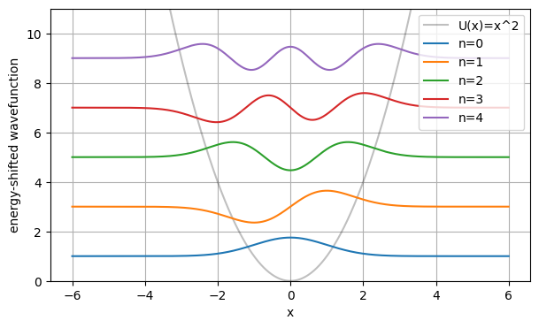

   The first five harmonic-oscillator eigenfunctions, shifted by their
   eigenvalues and plotted over :math:`U(x)=x^2`.

Two-Dimensional Harmonic Oscillator
-----------------------------------

The same interface extends to multiple spatial coordinates by passing a
multi-entry ``N``, ``domain``, and ``k_diag``. For

.. math::

   H=-E_{mx}\frac{\partial^2}{\partial x^2}
     -E_{my}\frac{\partial^2}{\partial y^2}
     +E_{ux}x^2+E_{uy}y^2,

the separable energy spectrum is

.. math::

   E_{n_x,n_y}=\sqrt{E_{mx}E_{ux}}(2n_x+1)
   +\sqrt{E_{my}E_{uy}}(2n_y+1).

The example below uses all four energy scales equal to one.

.. code-block:: python

   E_ms = [1, 1]
   E_us = [1, 1]

   U_ho_2d = lambda x, y: E_us[0]*x**2 + E_us[1]*y**2

   vals, vecs, xlists = eg.eigensolver(
       U_ho_2d,
       N=[101, 101],
       domain=[(-4, 4), (-4, 4)],
       k_diag=E_ms,
       Enum=6,
       which="SA",
   )

   exact_2d = sorted([
       np.sqrt(E_ms[0]*E_us[0])*(2*nx + 1)
       + np.sqrt(E_ms[1]*E_us[1])*(2*ny + 1)
       for nx in range(4)
       for ny in range(4)
   ])[:6]
   print("Numerical eigenvalues:", vals)
   print("Exact eigenvalues:    ", np.array(exact_2d))
   print("Errors:               ", vals - np.array(exact_2d))

   x, y = xlists
   X, Y = np.meshgrid(x, y, indexing="ij")

   plt.contourf(X, Y, np.real(vecs[1]), levels=40, cmap="RdBu_r")
   plt.gca().set_aspect("equal")
   plt.xlabel("x")
   plt.ylabel("y")
   plt.title(f"State 1, E={vals[1]:.5f}")
   plt.colorbar(label=r"$\psi(x,y)$")
   plt.show()

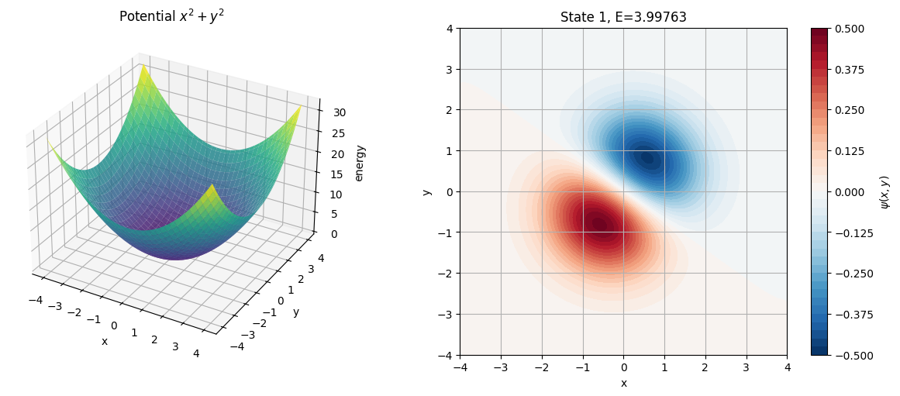

   A 2D harmonic-oscillator solve, showing the potential surface and one
   eigenfunction on the tensor-product grid.

Hydrogen Atom on a Cartesian Grid
---------------------------------

The finite-difference backend supports dimensions beyond the one-, two-, and
three-dimensional cases shown here. This example solves the hydrogen atom
directly on a 3D Cartesian grid, using angstroms for coordinates and
electron-volts for energies:

.. math::

   H=-\frac{\hbar^2}{2m_e}\nabla^2-\frac{e^2}{4\pi\epsilon_0 r}.

To keep the example reasonably quick and stable, the Coulomb singularity at
``r=0`` is clipped at a small radius. The potential is also shifted upward by a
constant so that the targeted bound-state energies lie near zero during the
solve. That offset is subtracted from the eigenvalues afterward.

.. code-block:: python

   q_e = 1.60217663e-19
   m_e = 9.1093837e-31
   eps0 = 8.85418782e-12
   hbar = 1.054571817e-34

   r_cutoff = 0.2
   k_HA_2eV = hbar**2 / (2 * m_e * q_e * 1e-20)
   offset = q_e * 1e10 / (r_cutoff * eps0 * 4 * np.pi)

   def U_hydrogen_shifted(x, y, z):
       r = np.sqrt(x*x + y*y + z*z)
       r_eff = np.maximum(r, r_cutoff)
       return -q_e * 1e10 / (r_eff * eps0 * 4 * np.pi) + offset

   vals, vecs, xlists = eg.eigensolver(
       U_hydrogen_shifted,
       N=[41, 41, 41],
       domain=[(-10, 10), (-10, 10), (-10, 10)],
       k_diag=[k_HA_2eV, k_HA_2eV, k_HA_2eV],
       Enum=5,
       method="finite_difference",
       which="SA",
   )

   hydrogen_vals = vals - offset
   expected = np.array([-13.6 / n**2 for n in [1, 2, 2, 2, 2]])

   print("Numerical bound energies, eV:", hydrogen_vals)
   print("Reference pattern, eV:       ", expected)
   print("Errors, eV:                  ", hydrogen_vals - expected)

Increasing the grid size and domain improves convergence, at the cost of a
larger sparse eigenproblem.

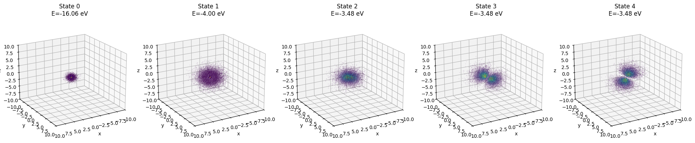

   Probability-density samples for the first five hydrogen states from the
   direct 3D Cartesian-grid solve.

Continuous-Discrete Coupling
----------------------------

``Ceigensolver`` extends the continuous spatial problem with a
finite-dimensional discrete basis. The returned wavefunctions have shape
``(Enum, M, *N)``, where ``M`` is the dimension of the discrete basis.

This is useful for Hamiltonians written in a mixture of discrete and continuous
bases. The following circuit-QED example couples a continuous harmonic
oscillator coordinate to a two-level subsystem.

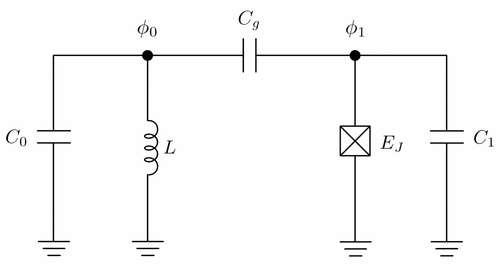

   Circuit model for a continuous oscillator coupled to a qubit-like two-level
   subsystem.

.. math::

   H = H_0 + H_1 + H_c,

where

.. math::

   H_0=-E_C\frac{d^2}{d\phi^2}+E_L\phi^2,
   \qquad
   H_1=\begin{pmatrix}0&0\\0&E_q\end{pmatrix}.

The oscillator Hamiltonian uses
:math:`E_C=2e^2/C_0` and
:math:`E_L=(\hbar/2e)^2/(2L)`. The two-level subsystem has approximate
transition energy :math:`E_q\approx\sqrt{E_{C,1}E_J}-E_{C,1}/4`. The coupling
capacitor gives the derivative coupling

.. math::

   H_c=\begin{pmatrix}
   0 & -E_g\frac{d}{d\phi}\\
   E_g\frac{d}{d\phi} & 0
   \end{pmatrix},

where :math:`E_g\approx 4e^2 C_g n_{J,\mathrm{zpf}}/(C_0 C_1)` for
:math:`C_g\ll C_0,C_1` and
:math:`n_{J,\mathrm{zpf}}=(E_J/(8E_{C,1}))^{1/4}`.

The derivative coupling is supplied with ``k_coup``. Linear position couplings
of the form :math:`E_g\phi_0\phi_1` can be supplied with ``v_coup``.

For more than one continuous coordinate, pass a dictionary keyed by coordinate
axis. For example, ``k_coup={0: K_phi, 1: K_theta}`` applies one discrete
coupling matrix to derivatives along coordinate 0 and another to derivatives
along coordinate 1.

Couplings can also be written as a list of pair dictionaries, one dictionary
per continuous coordinate. This is often the most direct representation of

.. math::

   H_c=\sum_i \sum_{n>m}
   \left(-k_{c,i,nm}\frac{d}{dx_i}+v_{c,i,nm}x_i\right)
   |n\rangle\langle m|+\mathrm{h.c.}

For example:

.. code-block:: python

   k_coup = [
       {(0, 1): E01_phi, (1, 2): E12_phi},  # derivative couplings along axis 0
       {(0, 2): E02_theta},                 # derivative couplings along axis 1
   ]

   v_coup = [
       {(0, 1): V01_phi},
       {},
   ]

For derivative couplings, the conjugate partner is filled with the sign needed
to produce a Hermitian total derivative operator. For position couplings, the
conjugate partner is filled in the usual Hermitian way.

The full coupled wavefunction returned by the solver has components
:math:`\Psi_i(\phi)=\langle \phi,i|\Psi\rangle`, subject to the normalization
:math:`\int\sum_i|\Psi_i(\phi)|^2\,d\phi=1`. With :math:`\hbar=1`, the
oscillator level spacing for this convention is :math:`2\sqrt{E_CE_L}`. The
example below chooses ``E_q`` to match that spacing and uses a weak derivative
coupling ``E_g``.

.. code-block:: python

   hbar = 1.0
   GHz = 1.0

   E_C = hbar * (2 * np.pi * 2.0 * GHz)
   E_L = hbar * (2 * np.pi * 6.0 * GHz)
   E_g = hbar * (2 * np.pi * 0.05 * GHz)

   omega_osc = 2.0 * np.sqrt(E_C * E_L) / hbar
   E_q = hbar * omega_osc

   H1 = np.array([
       [0.0, 0.0],
       [0.0, E_q],
   ])

   vals_c, vecs_c, xlists_c = eg.Ceigensolver(
       lambda x: E_L * x**2,
       H1,
       N=[801],
       domain=[(-4, 4)],
       k_diag=[E_C],
       k_coup=E_g,
       Enum=6,
       which="SA",
   )

   x = xlists_c[0]
   component_weight = np.sum(np.abs(vecs_c)**2, axis=2) * (x[1] - x[0])
   print("Coupled eigenvalues:", np.real(vals_c))
   print("Discrete component weights:", component_weight)

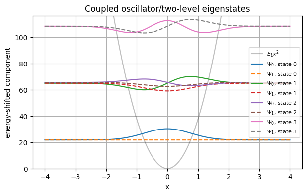

   The two discrete components of several coupled eigenstates, shifted by
   their eigenvalues.

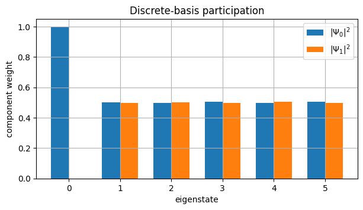

   Component weights show how much each eigenstate occupies each discrete
   basis level.

Coupled Josephson Junctions and Mixed Derivatives
-------------------------------------------------

The standard solver supports mixed spatial derivative terms through
``k_cross``. Mixed derivative terms are not present for a single particle in
ordinary Cartesian coordinates, but they are useful for coupled generalized
momenta, such as in circuit-QED phase coordinates. For two coupled Josephson
junction phases, one possible Hamiltonian is:

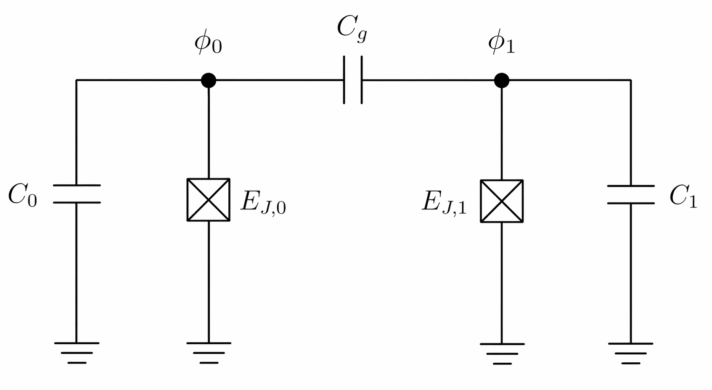

   Circuit model for two coupled Josephson junctions.

.. math::

   H=-E_{C,0}\frac{\partial^2}{\partial \phi_0^2}
     -E_{C,1}\frac{\partial^2}{\partial \phi_1^2}
     -E_g\frac{\partial^2}{\partial \phi_0\partial \phi_1}
     +U(\phi_0,\phi_1),

with

.. math::

   U(\phi_0,\phi_1)=E_{J,0}\left(1-\sin\phi_0\right)
   +E_{J,1}\left(1-\sin\phi_1\right).

Here :math:`E_{C,i}=2e^2/C_i` and
:math:`E_g\approx 4e^2 C_g/(C_0C_1)` for :math:`C_g\ll C_0,C_1`. The
diagonal kinetic terms are passed with ``k_diag`` and the mixed derivative is
represented with ``k_cross={(0, 1): E_g}``. The tuple ``(0, 1)`` indicates the
coordinate pair :math:`(\phi_0,\phi_1)`.

.. code-block:: python

   E_C0 = 2 * np.pi * 10.0
   E_C1 = 2 * np.pi * 10.0
   E_J0 = 2 * np.pi * 2.0
   E_J1 = 2 * np.pi * 2.0
   E_g = 2 * np.pi * 0.05

   def U_phase(phi0, phi1):
       return E_J0 * (1 - np.sin(phi0)) + E_J1 * (1 - np.sin(phi1))

   vals_phase, vecs_phase, phase_lists = eg.eigensolver(
       U_phase,
       N=[121, 121],
       domain=[(-np.pi, 2*np.pi), (-np.pi, 2*np.pi)],
       k_diag=[E_C0, E_C1],
       k_cross={(0, 1): E_g},
       Enum=5,
       method="finite_difference",
       which="SA",
   )

   print("Eigenvalues:", vals_phase)

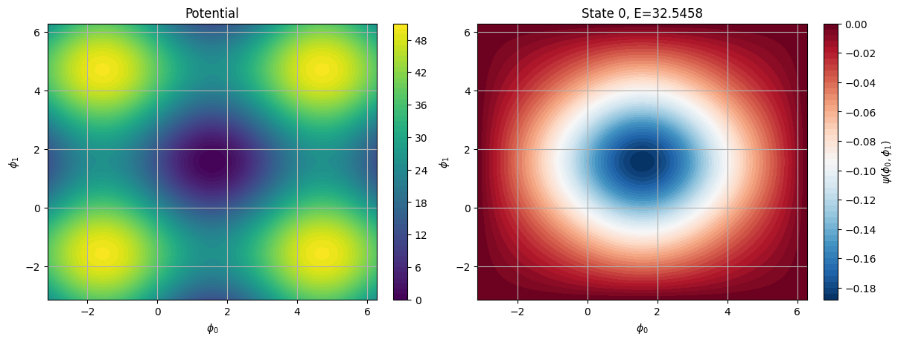

   The Josephson potential and the lowest eigenfunction from a 2D solve with
   a mixed derivative term.

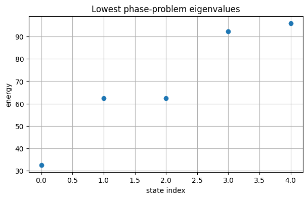

   Lowest eigenvalues from the coupled phase problem.

Backend Comparison with the Airy Problem
----------------------------------------

The available backend names can be inspected programmatically:

.. code-block:: python

   print(eg.available_methods())

The default method is ``"finite_difference"``. The ``"FEM"`` backend uses
``scikit-fem`` and supports one-, two-, and three-dimensional problems. The
finite-difference backend supports arbitrary dimension, subject to the memory
and runtime cost of the resulting sparse matrix.

The Airy problem,

.. math::

   H=-k\frac{d^2}{dx^2}+|x|,

is a useful comparison because the decaying solutions are Airy functions. Even
states are fixed by zeros of :math:`\mathrm{Ai}'`, and odd states are fixed by
zeros of :math:`\mathrm{Ai}`. This gives an analytic reference for comparing
the finite-difference and finite-element backends.

Discontinuous or non-differentiable potentials can reduce finite-difference
accuracy, especially when high-precision eigenvectors are required. The FEM
backend provides an alternative discretization that can behave better near
non-smooth points.

.. code-block:: python

   U_abs = lambda x: np.abs(x)

   common = dict(
       U=U_abs,
       N=[801],
       domain=[(-12, 12)],
       k_diag=[1],
       Enum=5,
       which="SA",
   )

   vals_fd, vecs_fd, xlists_fd = eg.eigensolver(
       method="finite_difference",
       **common,
   )
   vals_fem, vecs_fem, xlists_fem = eg.eigensolver(
       method="FEM",
       intorder=None,
       **common,
   )

   print("Finite difference:", vals_fd)
   print("FEM:              ", vals_fem)

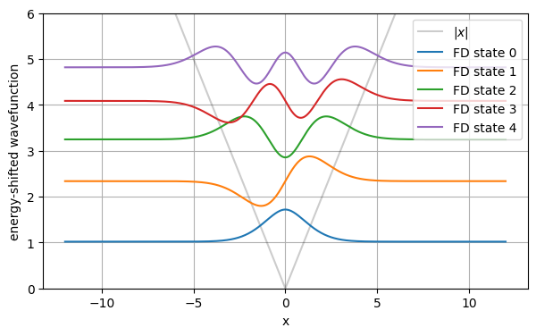

   Finite-difference eigenfunctions for :math:`U(x)=|x|`, shifted by their
   eigenvalues.

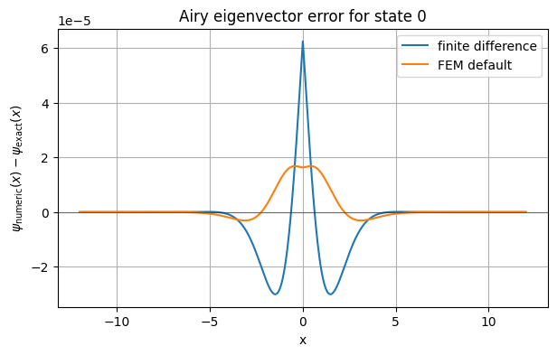

   Eigenvector error against the analytic Airy solution for finite difference
   and FEM.

The full notebooks include the plotting setup and analytic-comparison helper
functions used to generate these figures.
